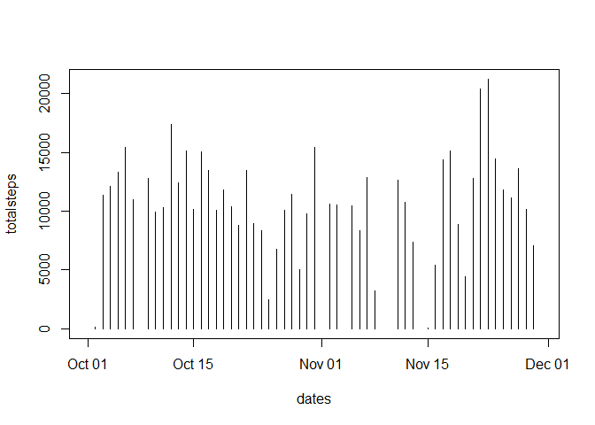
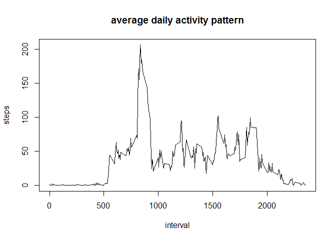
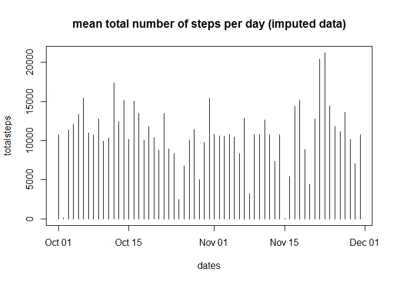
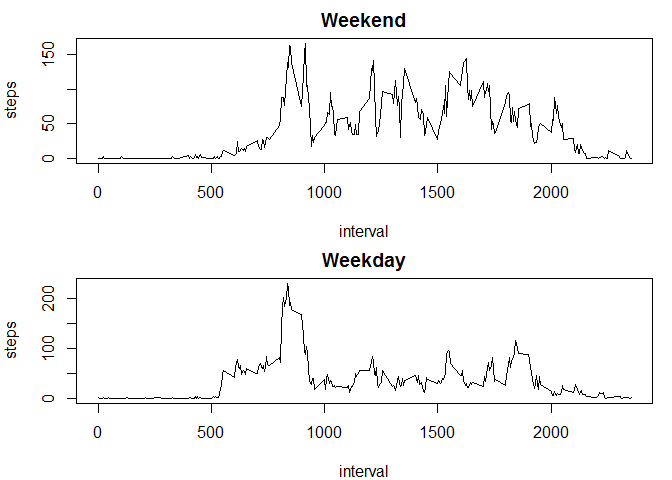

# Reproducible Research: Peer Assessment 1


## Loading and preprocessing the data
We load the data in a variable called *activity*

```r
activity<-read.csv("activity.csv", header = TRUE)
## changing format to dates
activity$date<-as.Date(activity$date)
```


## What is mean total number of steps taken per day?
We first compute the total number of steps taken per day

```r
totalsteps<-with(activity, sapply(split(steps, date),sum))
dates<-unique(activity$date)
plot(dates,totalsteps, type = "h")
```

<!-- -->

```r
mean.steps<-mean(totalsteps, na.rm = TRUE)
median.steps<-median(totalsteps, na.rm = TRUE)
```

for the total number of steps taken per day, the mean is 1.0766189\times 10^{4} and the median is 10765. 

## What is the average daily activity pattern?
Firts we have to aggregate the data by 5-minutes intervals.

```r
intervalstat<-aggregate(steps~interval, data=activity, mean, na.rm=TRUE)
with(intervalstat, plot(interval, steps, type="l"))
```

<!-- -->

```r
maxnb<-intervalstat$interval[which.max(intervalstat$steps)]
```
The interval 835 contains, on average, the maximum number of steps. 


## Imputing missing values
before imputing the missing values, let's find the total number of missing values in the dataset

```r
sum(is.na(activity$steps))
```

```
## [1] 2304
```

```r
sum(is.na(activity$steps))/nrow(activity)
```

```
## [1] 0.1311475
```

To make it easy, we will impute the missing values with the the mean for that 5-minute interval.


```r
activity.imp<-activity
for (i in 1:nrow(activity.imp))
  {
    if (is.na(activity.imp$steps[i]))
    {
      k<-intervalstat$interval==activity.imp$interval[i]
      activity.imp$steps[i]<-intervalstat$steps[k]
    }
  }
```

Now we make a similar summary for the imputed data. 
First with the histogram

```r
totalsteps<-with(activity.imp, sapply(split(steps, date),sum))
plot(dates,totalsteps, type = "h")
```

<!-- -->

```r
mean.imp<-mean(totalsteps, na.rm = TRUE)
median.imp<-median(totalsteps, na.rm = TRUE)
```

The mean remained the same 1.0766189\times 10^{4}  (previously:  1.0766189\times 10^{4}), while the median became 1.0766189\times 10^{4} compared to 10765 previously. 

## Are there differences in activity patterns between weekdays and weekends?
we will class days as weekends or weekdays, then we will split the data accordingly and compute the means per interval.

```r
days<-weekdays(activity.imp$date)
weekend<-c("Sunday", "Saturday")
days[days %in% weekend]<-"weekend"
days[days != "weekend"]<-"weekday"
activity.imp$days<-days

## split data and aggregate
activity.split<-split(activity.imp,activity.imp$days)
intervalstat.wday<-aggregate(steps~interval, data=activity.split$weekday, mean)
intervalstat.wend<-aggregate(steps~interval, data=activity.split$weekend, mean)

## plotting
par(mfrow=c(2,1), mar=c(4,4,2,1))
with(intervalstat.wend, plot(interval, steps, type="l", main="Weekend"))
with(intervalstat.wday, plot(interval, steps, type="l", main="Weekday"))
```

<!-- -->
